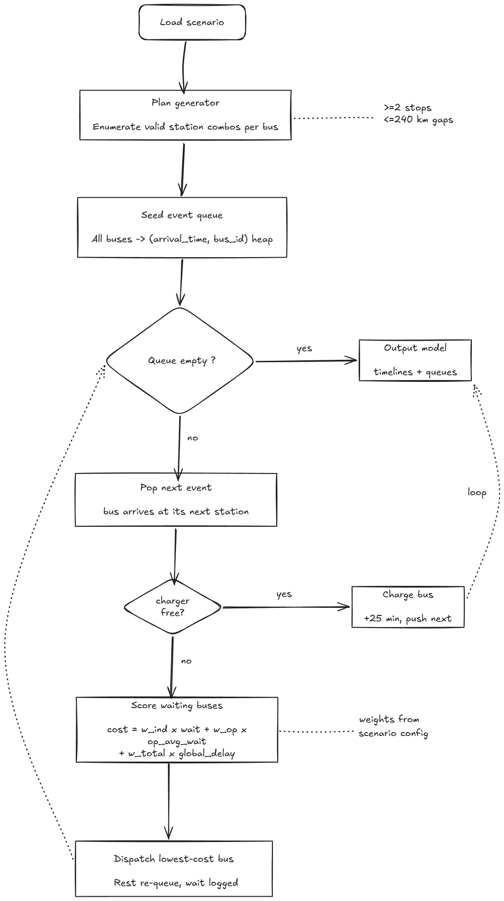

# Bus Charging Scheduler

Schedule electric bus charging on the **Bengaluru ↔ Kochi** route (540 km, stations A–D, 240 km range, 25 min charge).

## Architecture




JSON scenario files feed the engine (plan selection, event simulation, weighted scoring), which produces timetables for the Streamlit UI. See [ARCHITECTURE.md](ARCHITECTURE.md) for full design notes.

## Quick start

```bash
pip install -r requirements.txt
streamlit run app.py
```

CLI (no UI):

```bash
python -m src.cli --list
python -m src.cli scenario_1
python -m src.cli scenario_5
```

## How to change a weight

Edit one scenario file — e.g. `data/scenarios/scenario_4.json`:

```json
"weights": {
  "individual": 1.0,
  "operator": 2.0,
  "overall": 1.0
}
```

Reload the app. No code changes required.

## How to add a new scoring rule

1. Create `src/scoring/my_rule.py`:

```python
from src.scoring.base import ScoringContext, ScoringRule

class MyRule(ScoringRule):
    name = "my_rule"

    def score(self, context: ScoringContext) -> float:
        return 1.0  # higher = higher priority
```

2. Register in `DEFAULT_RULES` inside `src/scoring/engine.py`.
3. Add `"my_rule": 1.0` to the scenario `weights` block.

## Project layout

```
├── app.py                      # Streamlit UI
├── ARCHITECTURE.md
├── flowchart.png
├── High-Level System Architecture.png
├── data/
│   ├── SCENARIO_FORMAT.md
│   └── scenarios/              # scenario_1.json … scenario_5.json
├── scripts/build_scenarios.py
├── src/
│   ├── cli.py
│   ├── loader.py
│   ├── plans.py
│   ├── scheduler.py
│   ├── validation.py
│   ├── route_utils.py
│   └── scoring/
└── tests/
```

## Scenarios

| # | Name | Buses | Notes |
|---|------|-------|-------|
| 1 | Even Spacing | 20 | Every 15 min from 19:00 both directions |
| 2 | Bunched Start | 20 | 8 min cluster, heavy early contention |
| 3 | Asymmetric Load | 14 | 10 BK + 4 KB |
| 4 | Operator-Heavy | 20 | 8 KPN on BK; `operator = 2.0` |
| 5 | Worst Case | 20 | All buses within 72 min (19:00–20:12) |

Regenerate: `python scripts/build_scenarios.py`

## Tests

```bash
python -m pytest tests/ -q
```

## Assumptions

- Travel minutes = distance km at 60 km/h (100 km → 100 min).
- Endpoints excluded from scheduling; only A–D have chargers.
- Each bus charges ≥ 2 times; scheduler chooses which stations.
- Bidirectional traffic shares the same chargers.
